<picture>
  <source media="(prefers-color-scheme: dark)" srcset="assets/profile-hero-dark.svg">
  <source media="(prefers-color-scheme: light)" srcset="assets/profile-hero-light.svg">
  
</picture>

## GitHub Activity

## Connect With Me

---

Keep Learning - Keep Building - Keep Securing
